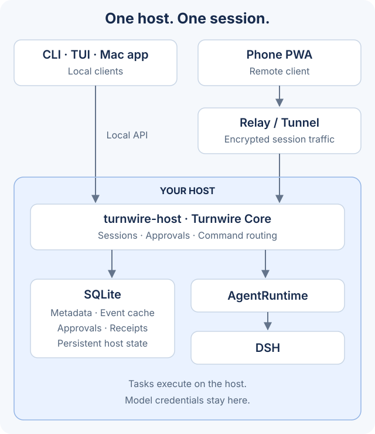

[English](README.md) · 中文

# Turnwire

同一个 Agent 会话，在 Mac、终端和手机上接续：**主机负责干活，手机负责随时接话和审批。**

### 它们如何协作



- **客户端：** CLI、交互终端（TUI）、原生 Mac 应用和手机 PWA，都访问同一台主机、共享同一份会话状态。
- **远程连接：** 手机通过 Relay 或已配置的隧道连接主机。配对后的会话通信经过加密，Relay 只转发密文。
- **主机与状态：** `turnwire-host` 运行 Turnwire Core；SQLite 保存元数据、事件缓存、审批和命令回执。
- **任务执行：** Turnwire Core 通过 `AgentRuntime` 接口将任务交给 DSH。模型凭据和任务执行始终留在主机上。

## 它能给你什么

- **离开电脑也不断线**：手机上看到同一条会话的实时进度，把下一步想法发回主机；消息要么排队等当前回合结束，要么直接插话引导它。
- **审批在手机上完成**：需要放行的操作弹到手机，批准或拒绝一次有效，处理结果留在收件箱里可回查。
- **一份状态，四端一致**：CLI、交互终端、原生 Mac 应用和手机 PWA 共享会话、历史、审批与模型选择，不是四套各记各的。
- **模型由主机决定**：手机上也能切换会话模型与思考强度，只列出主机 runtime 真正注册的模型。
- **跑在你自己的机器上**：异地连接走临时隧道或你自己部署的 Relay；主机主动连出，不需要把 daemon 端口暴露到公网。

## 开始之前，先看这三条

诚实前置，免得你走到一半才发现：

1. **目前没有签名的发行版**。要装就得从源码构建，或运行仓库里的安装脚本；两个仓库现在也是私有的。没有"下载双击即用"这一步。
2. **需要一台常开的主机**。Mac（推荐，能跑原生应用）或一台 Linux 机器都可以 —— 主机睡着，手机就连不上。
3. **需要模型凭据，而且只留在主机上**。API key 由主机上的 DSH 读取，不进客户端、不进 Relay、不进隧道进程。

## 开始使用

### Linux 一命令启动

在源码目录运行 `bash scripts/start-host.sh`（已装 Node/npm 时也可 `npm start`）。首次自动准备主机并隐藏输入模型密钥；再次运行不打断正在运行的同目录服务，已安装但停止的服务直接启动。手机公网连接仍需明确配置。前置条件、安全边界及验证状态见[一命令启动](docs/QUICKSTART.zh.md)。

### 第 1 步：主机跑起来

最快看到全貌的方式是用离线 Demo（不需要任何模型凭据）：

```bash
git clone https://github.com/turnwire/turnwire.git
cd turnwire
npm ci
npm run build
TURNWIRE_RUNTIME=demo npm run dev
```

浏览器打开 `http://127.0.0.1:9898`，选「本机连接」，填入 `npm run turnwire -- connect` 输出的地址和令牌。Demo 不调用模型、不运行 shell、不修改文件；输入包含「审批」时会产生一条演示审批。

要接上真实模型（DeepSeek via DSH），见 [从源码开发](docs/DEVELOPING.zh.md)。

### 第 2 步：装上你要的客户端

| 你想要 | 怎么装 | 需要什么 |
| --- | --- | --- |
| Mac 原生应用（最完整） | `cd ../turnwire-desktop && bash scripts/bundle.sh && open dist/Turnwire.app` | macOS 14+、Xcode 16+ / Swift 6；产物是 ad-hoc 签名，对外发布还需 Developer ID 与 notarization |
| 常驻主机（Linux，无界面） | 在构建好的 release 里运行 `scripts/install-linux-host.sh` | Linux + systemd，且先写好私有 DSH 环境文件（默认 `~/.config/turnwire/dsh.env.json`；支持 `TURNWIRE_CONFIG_HOME` / `XDG_CONFIG_HOME` 或 `TURNWIRE_DSH_ENV_FILE`） |
| 自托管 Relay（长期稳定地址） | `deploy/` 下有 Dockerfile、compose.yaml 与 Caddyfile | 一台服务器；详见[一键部署 Relay](docs/RELAY-INSTALL.zh.md) |
| 终端 / 脚本 | `npm run turnwire -- ...`，或构建后 `node apps/cli/dist/main.js ...` | Node.js 22.13+；命令见[命令行参考](docs/CLI.zh.md) |

### 第 3 步：让手机连上

本机地址 `127.0.0.1` 只代表那台机器自己，手机上的 `127.0.0.1` 是手机自己 —— 所以异地连接必须有一条公网通道。三种选择：

| 方式 | 使用流程 |
| --- | --- |
| 临时隧道 | 选 localhost.run、cpolar 或 Cloudflare，点「开启临时访问」；不需要自己的服务器。cpolar 首次需要账号 Auth Token。**地址会在 daemon 下次启动时变化，需要重新配对** |
| Cloudflare 命名隧道 | 用你自己 Cloudflare 账号下**已存在**的隧道与固定域名，地址不随重启变化；需要隧道名、公开域名与隧道凭据文件 |
| 自托管 Relay | 填服务器的 HTTPS 地址与 Relay 连接密钥，点「保存并连接」；长期使用推荐，也是手机推送的前提 |

通道就绪后生成配对二维码，手机打开已部署的 PWA 粘贴配对码即可。配对链接把密钥放在 URL fragment 中，网页接收后立即移除；默认只为本次浏览会话保存，勾选「记住这台受信任设备」才持久保存。

> 国内网络可能连不上 Cloudflare 临时隧道，或出现延迟与不稳定 —— 它作为快速体验选项保留。长期使用建议选择在 Mac 和手机实际网络中验证过的自托管 Relay；免费 Quick Tunnel 不等同于 Cloudflare China Network（那是另行订阅的企业服务）。

## 手机上能做什么

- 接续同一条会话：看实时进度、发送补充指令、停止正在跑的回合
- 处理审批与收件箱：批准 / 拒绝、回查已处理与已过期的操作
- 切换会话模型与思考强度：输入框上方的小 chip，只列出主机 runtime 注册的模型
- 会话运行中发送时可选**排队**（等当前回合结束）或**插话**（直接引导当前回合），消息上会标出当时用的是哪种
- 会话已归档时仍可查看历史，需要时取消归档继续

## 已知限制

- **Mac 要醒着、联网**：主机不在线，手机看不到进度。
- **手机推送需要自托管 Relay**：临时地址不支持长期推送（`turnwire notifications status` 会明确告诉你）。
- **切换地址要重新配对**：临时隧道每次重启都会换地址。
- **原生应用是 ad-hoc 签名**：只适合自用或内部分发。
- **没有模型凭据时只能跑 Demo**，无法执行真实编码任务。

## 深入文档

| 文档 | 内容 |
| --- | --- |
| [命令行参考](docs/CLI.zh.md) | 全部 `turnwire` 命令与选项 |
| [从源码开发](docs/DEVELOPING.zh.md) | 构建、接真实 DSH、验证方式、工程结构 |
| [多端功能对等](docs/CLIENTS.zh.md) | 每项能力在各客户端的覆盖与代码归属 |
| [自托管 Relay + PWA](docs/DEPLOYMENT.zh.md) | 固定域名部署、国内网络说明 |
| [一键部署 Relay](docs/RELAY-INSTALL.zh.md) | 从部署表单一键安装服务器 |
| [用 Turnwire 开发 Turnwire](docs/SELF-HOSTING.zh.md) | 开发主机自动更新与安全点 |
| [DSH 接口说明](docs/DSH.zh.md) / [协议与状态边界](docs/PROTOCOL.zh.md) | 运行时契约与 RPC 边界 |
| [验证记录](docs/VALIDATION.zh.md) | 已验证与未验证的条件，逐条列出 |
| [参与贡献](CONTRIBUTING.zh.md) / [安全策略](SECURITY.zh.md) | 开发约束、验证要求与漏洞报告渠道 |

## 现状与边界

当前交付包含一次性配对、经设备凭据认证的每连接 ECDH 会话加密、分阶段连接恢复、持久审批收件箱、Web Push 和可配置的 TLS 局域网入口。配对与远程传输仅支持 v2，不支持 v1 设备或凭据升级；应从主机创建新的 v2 配对。RPC/事件信封仍为 v1。Store 拒绝旧数据库且不迁移，应使用独立的空数据库。Relay 的连接路由仍在内存中，推送密钥与投递队列持久化。

尚不包含 Codex / Claude adapter、团队账户、原生 iOS、自动更新或发行签名。"哪些只在特定条件下验证过"以 [验证记录](docs/VALIDATION.zh.md) 为准。

## 许可

Apache License 2.0 —— 详见 [LICENSE](LICENSE) 与 [NOTICE](NOTICE)。可以自由使用、修改和分发（含商用），需要保留版权与许可声明；本项目不提供任何担保。
